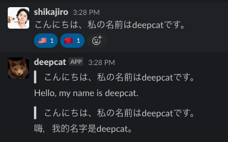

# 概要
deepl-botはslackのメッセージにリアクションして翻訳するslack-botです。DeepLAPIを利用しています。v0.4現在、日本語、イギリス英語、アメリカ英語、中国語に対応しています。

# 使い方
翻訳したいメッセージ対してフラグのリアクションします。



|言語|フラグ|言語表現|
|---|---|---|
|日本語|:jp:|JA|
|イギリス英語|:gb:|EN-GB|
|アメリカ英語|:us:|EN-US|
|中国語|:cn:|ZH|

元となる言語は自動判定です。

# デプロイ方法

pythonを直接動かす場合
```
SLACK_BOT_TOKEN=<slack_bot_token> \
SLACK_APP_TOKEN=<slack_app_token> \
DEEPL_API_TOKEN=<deepl_api_token> \
poetry run python run.py
```

Dockerで動かす場合
```
SLACK_BOT_TOKEN=<slack_bot_token> \
SLACK_APP_TOKEN=<slack_app_token> \
DEEPL_API_TOKEN=<deepl_api_token> \
docker run -d ghcr.io/shikajiro/deepl-bot:latest
```
